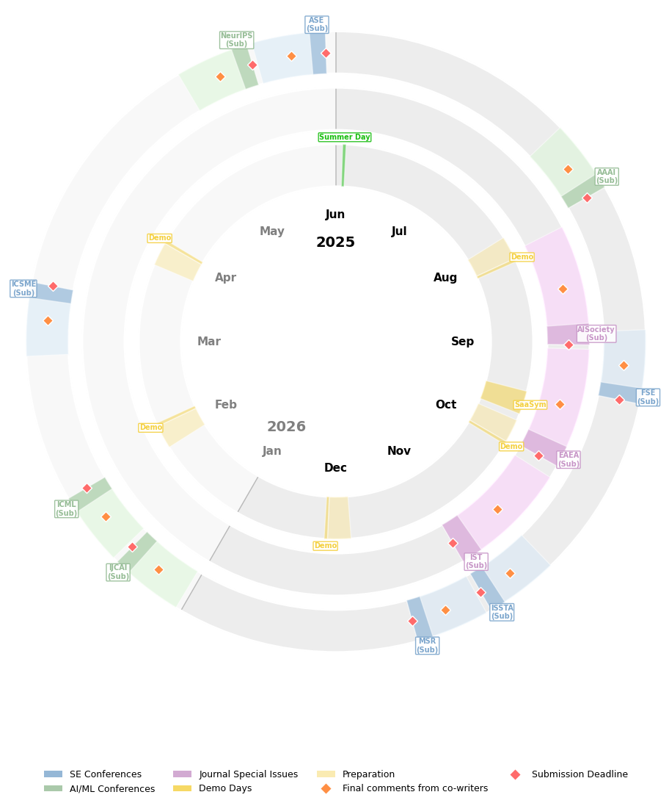

# Research Year Clock

This tool visualizes GPT-lab AI research deadlines, demo days, and related milestones in a radial calendar. It's designed to eventually serve as an internal online dashboard showing when and where an AI agent updates project timelines.

## Features

- Circular plot of key dates (conferences, journals, demo days)
- Auto-generated preparation periods and milestone markers
- Clear ring-based segmentation for event types

## Quick Start

```
git clone git@github.com:GPT-Laboratory/Publication-Year-Wheel.git
pip install matplotlib
python conference_clock.py
```

## Sample Output



## TODO (Plz contribute)

- [ ] Replace hardcoded data import with dynamic API or database queries  
- [ ] Implement an AI agent that scrapes up to date information from the internet
- [ ] Turn plotting into service endpoint 
- [ ] Add Flask/FastAPI backend to serve images and event updates  
- [ ] Implement some interactivity
- [ ] Implement authentication and update logging for AI agent actions  
- [ ] Export visualization as SVG for integration in web UIs  
